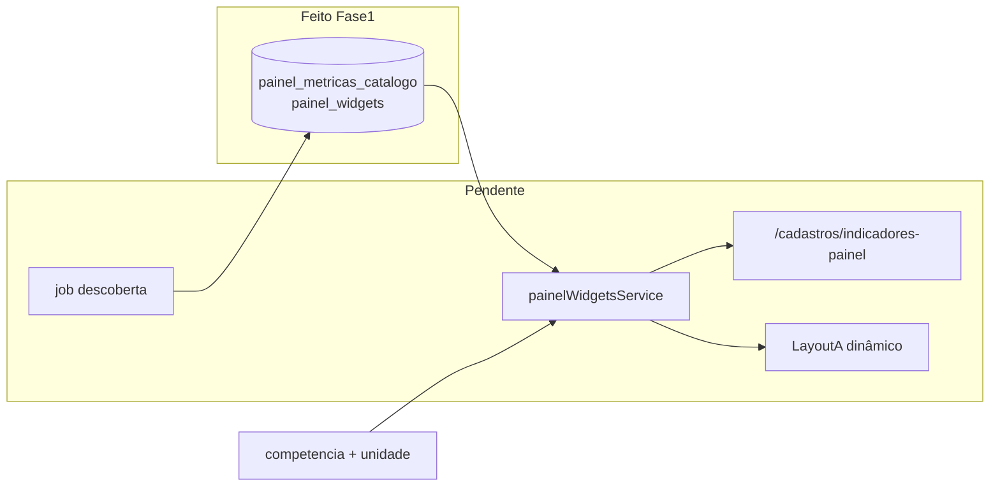

# Spec completa — Painel dinâmico (feito + backlog)

## Entregável

Atualizar e expandir [`docs/superpowers/specs/2026-06-20-painel-widgets-dinamicos-design.md`](docs/superpowers/specs/2026-06-20-painel-widgets-dinamicos-design.md) para ser o **documento único** do feature: decisões de produto, o que foi implementado, o que permanece hardcoded, e todos os blocos pendentes (independentes, reordenáveis).

Não alterar código nesta etapa — apenas o arquivo de spec (+ referência cruzada mínima em [`docs/agent/README.md`](docs/agent/README.md) se necessário).

---

## Seção 1 — Contexto e decisões (já acordadas)

Registrar no arquivo:

- **Objetivo:** cadastro de indicadores/widgets em `/cadastros/` para compor o Painel APS (Layout A) de forma dinâmica.
- **Fonte de dados:** SQL em tempo real via templates parametrizados (opção B); SQL legível só para visualização admin (opção C).
- **Permissão:** escrita restrita a Administrador + Planejamento (`requirePlanningStaff` — mesmo padrão de [`simpa-backend/src/routes/cadastros.js`](simpa-backend/src/routes/cadastros.js)).
- **Escopo MVP funcional:** perfil `APS`, layout `A`, paridade com os 6 cards + 2 gráficos atuais em [`simpa-frontend/src/pages/Painel/LayoutA.tsx`](simpa-frontend/src/pages/Painel/LayoutA.tsx).

Diagrama de arquitetura alvo:



---

## Seção 2 — O que FOI implementado (detalhar no arquivo)

### 2.1 Migration e schema

Arquivo: [`migration_008_painel_widgets.sql`](migration_008_painel_widgets.sql)

**Tabela `painel_metricas_catalogo`**
- Catálogo flat de métricas com metadados EAV e-SUS (`tipo_relatorio`, `secao`, `descricao_linha`, `campo_json`).
- `fonte_tipo`: `esus_raw` | `sia` | `consolidado` | `meta` | `placeholder`.
- `agregacao`: `valor_unico`, `sum_turnos`, `historico`, `ranking_unidade`, etc.
- `sql_template`: query parametrizada com `:competencia`, `:estabelecimento_id`, `:equipe_id`.
- Campos reservados para descoberta automática futura: `descoberto_em`, `ultima_carga_em`, `ocorrencias`.

**Tabela `painel_widgets`**
- Slot de layout: `perfil`, `layout`, `ordem`, `tipo` (`card` | `grafico_linha` | `grafico_ranking` | `grafico_barra`).
- FK opcional `metrica_id` e `spark_metrica_id` → catálogo.
- `fonte_config`, `spark_config`, `delta_config` (JSONB) para fallbacks, eixos, par de métricas (ex.: metas X/Y).
- `sql_preview` para exibição admin.
- UNIQUE `(perfil, layout, slug)`.

### 2.2 Seed (paridade Layout A atual)

**10 métricas** seedadas — mapeamento do ETL em [`etl_contract.py`](etl_contract.py) / agregação municipal em [`dashboardService.js`](simpa-backend/src/services/dashboardService.js):

| Chave | Fonte | Uso |
|-------|-------|-----|
| `esus.atendimento_individual.resumo.registros.quantidade` | esus_raw | Card atendimentos |
| `esus.atendimento_individual.turnos.soma.quantidade` | esus_raw | Fallback atendimentos |
| `esus.atendimento_odontologico.resumo.registros.quantidade` | esus_raw | Card odonto |
| `esus.atividade_coletiva.participantes.total.quantidade` | esus_raw | Card coletivas |
| `esus.atendimento_individual.historico.mensal` | consolidado | Spark + gráfico linha |
| `esus.atendimento_individual.ranking.unidade` | consolidado | Gráfico ranking |
| `consolidado.financiamento.metas_atingidas` | consolidado | Card metas (numerador) |
| `consolidado.financiamento.metas_total` | consolidado | Card metas (denominador) |
| `placeholder.cobertura_aps` | placeholder | Card cobertura (NULL) |
| `placeholder.equipes_ativas` | placeholder | Card equipes (NULL) |

**8 widgets** APS Layout A — espelham [`buildPainelKpis()`](simpa-frontend/src/utils/dashboardView.ts) + charts de LayoutA.

### 2.3 Infra e docs tocadas

- [`docker-compose.yml`](docker-compose.yml): init `08-migration_008_painel_widgets.sql`.
- [`docs/agent/database.md`](docs/agent/database.md): tabelas migration 008 documentadas.
- Migration **aplicada manualmente** no container `simpa-postgres-1` (DB existente); novos ambientes Docker recebem via initdb.

### 2.4 O que NÃO mudou (Painel continua estático)

Explicitar no arquivo que **nenhuma linha de runtime** foi alterada:

| Componente | Estado atual |
|------------|--------------|
| [`LayoutA.tsx`](simpa-frontend/src/pages/Painel/LayoutA.tsx) | Chama `buildPainelKpis`, `buildTrendSeries`, `buildRanking` hardcoded |
| [`LayoutB.tsx`](simpa-frontend/src/pages/Painel/LayoutB.tsx), [`LayoutC.tsx`](simpa-frontend/src/pages/Painel/LayoutC.tsx) | Idem via `buildPainelKpis` |
| [`useDashboard.ts`](simpa-frontend/src/hooks/useDashboard.ts) | Só `fetchDashboard` — sem endpoint de widgets |
| [`dashboard.js`](simpa-backend/src/routes/dashboard.js) | Só `/planejamento` e `/consolidar` |
| [`cadastros.js`](simpa-backend/src/routes/cadastros.js) | Sem rotas painel-widgets |
| [`cadastroEntities.ts`](simpa-frontend/src/config/cadastroEntities.ts) | Card "Indicadores e Metas" ainda aponta para `/admin` (externo) |
| Tabela `indicadores` (migration 003) | **Separada** de `painel_metricas_catalogo` — sem integração |

---

## Seção 3 — Backlog completo (NÃO implementado)

Listar cada bloco como **módulo independente** com escopo, arquivos-alvo e critérios de pronto. Ordem a definir pelo usuário.

### Módulo A — Backend: serviço executor de métricas

**Escopo:** executar `sql_template` com segurança; substituir placeholders; tratar NULL nos filtros.

**Arquivos novos/alterados:**
- `simpa-backend/src/services/painelMetricsService.js` — `executeMetricTemplate(metricaId, { competencia, estabelecimentoId, equipeId })`
- `simpa-backend/src/services/painelWidgetsService.js` — orquestração por widget

**Regras a implementar:**
- Proibir SQL arbitrário: só templates do catálogo (whitelist por `metrica_id`).
- Resolver `fonte_config.fallback_chave` (ex.: atendimentos → turnos se NULL).
- Widget `formato: fracao` com `par_chave` (metas atingidas/total).
- Widget `delta_config` (comparar competência anterior — hoje em [`dashboardView.ts`](simpa-frontend/src/utils/dashboardView.ts) via `computeDelta`).
- Widget spark: executar `spark_metrica_id` com `spark_config`.

**Testes:** Jest em `simpa-backend/tests/painelMetricsService.test.js` (mock `query`, templates seed).

---

### Módulo B — Backend: API CRUD cadastro (planning staff)

**Escopo:** endpoints REST para widgets e catálogo.

**Rotas propostas** (em [`cadastros.js`](simpa-backend/src/routes/cadastros.js) ou sub-router):

| Método | Path | Auth | Função |
|--------|------|------|--------|
| GET | `/api/cadastros/painel-widgets?perfil&layout` | JWT | listar widgets ordenados |
| GET | `/api/cadastros/painel-widgets/:id` | JWT | detalhe + sql_preview |
| POST | `/api/cadastros/painel-widgets` | planning staff | criar |
| PUT | `/api/cadastros/painel-widgets/:id` | planning staff | editar |
| PATCH | `/api/cadastros/painel-widgets/reorder` | planning staff | reordenar |
| DELETE/inactivate | `/api/cadastros/painel-widgets/:id` | planning staff | soft-delete |
| GET | `/api/cadastros/painel-metricas` | JWT | catálogo flat (filtro fonte_tipo, q) |
| GET | `/api/cadastros/painel-metricas/:id` | JWT | detalhe + sql_template |
| POST | `/api/cadastros/painel-metricas/descobrir` | planning staff | job descoberta (Módulo F) |
| POST | `/api/cadastros/painel-widgets/preview` | planning staff | preview valor com competência teste |

**Auditoria:** `logAudit` em create/update/delete (padrão [`cadastros.js`](simpa-backend/src/routes/cadastros.js)).

**Docs:** [`docs/agent/backend-api.md`](docs/agent/backend-api.md), [`docs/agent/cadastros.md`](docs/agent/cadastros.md).

---

### Módulo C — Backend: API runtime Painel

**Escopo:** endpoint consumido pelo Painel com filtros ativos.

**Rota proposta:**
- `GET /api/v1/dashboard/painel-layout?competencia&estabelecimento_id&equipe_id&perfil=APS&layout=A`
- Resposta: `{ widgets: [{ slug, tipo, titulo, valor, valorLabel, sparkSeries?, series?, ranking?, isNull, delta? }] }`

**Arquivos:** [`dashboard.js`](simpa-backend/src/routes/dashboard.js) + `painelWidgetsService.js`.

**Decisão pendente (registrar no spec):** conviver com `/planejamento` (híbrido) ou substituir KPIs do JSON gradualmente.

---

### Módulo D — Frontend: cadastro `/cadastros/indicadores-painel`

**Escopo:** UI dedicada (não reutilizar `CadastroCrudPage` genérico — campos complexos).

**Arquivos novos:**
- `simpa-frontend/src/pages/Cadastros/IndicadoresPainelPage.tsx`
- `simpa-frontend/src/api/painelWidgets.ts`
- `simpa-frontend/src/types/painelWidgets.ts`

**Alterações:**
- [`Cadastros/index.tsx`](simpa-frontend/src/pages/Cadastros/index.tsx) — rota
- [`cadastroEntities.ts`](simpa-frontend/src/config/cadastroEntities.ts) — card no grid (substituir redirect `/admin` ou coexistir)
- [`App.tsx`](simpa-frontend/src/App.tsx) se rota top-level necessária

**Funcionalidades UI:**
- Lista widgets por perfil/layout com ordem
- Form: tipo, título, picker de métrica (lista flat do catálogo)
- Painel colapsável **SQL preview** (opção C) — readonly por padrão
- Botão **Preview** com competência + unidade teste
- Guard `canEditEnrichment` / planning staff para edição

---

### Módulo E — Frontend: Painel dinâmico (Layout A)

**Escopo:** renderizar a partir da API em vez de hardcode.

**Arquivos:**
- `simpa-frontend/src/hooks/usePainelLayout.ts` — fetch layout + valores
- Refatorar [`LayoutA.tsx`](simpa-frontend/src/pages/Painel/LayoutA.tsx) ou criar `DynamicLayoutA.tsx`
- Adaptadores: mapear resposta API → `KpiCard`, `EChart` (`trendOption`, ranking bars)

**Fallback:** se API falhar ou zero widgets, manter comportamento atual (`buildPainelKpis`) — feature flag ou detecção de seed.

**Testes:** Vitest em `dashboardView` / novo hook; atualizar testes LayoutA existentes.

---

### Módulo F — Job descoberta de métricas

**Escopo:** popular/atualizar catálogo a partir de `esus_indicadores_raw`.

**Lógica:**
```sql
SELECT DISTINCT c.tipo_relatorio, r.secao, r.descricao, jsonb_object_keys(r.valores)
FROM esus_indicadores_raw r JOIN esus_cargas c ...
```
- Gerar `chave` estável + `label` sugerido
- UPSERT em `painel_metricas_catalogo`; incrementar `ocorrencias`
- Gerar `sql_template` default a partir do padrão seed
- Invocar: botão no cadastro + opcional pós-importação ([`importacao.js`](simpa-backend/src/routes/importacao.js))

---

### Módulo G — Layouts B/C e outros perfis

**Escopo:** estender widgets para Layout B/C e perfis MAC/Hospitalar/Misto.

**Depende de:** Módulos A–E estáveis no Layout A.

**Nota:** Layouts B/C usam disposição diferente do mesmo catálogo KPI — exige `fonte_config.slot` ou widgets com `tipo` específico (hero, tabela unidades).

---

### Módulo H — Integração tabela `indicadores` (migration 003)

**Escopo:** alinhar `indicadores` (C1, B1, metas regulamentadas) com `painel_metricas_catalogo`.

**Opções (registrar no spec, decisão futura):**
- FK `painel_metricas_catalogo.indicador_id` → `indicadores.id`
- Ou view unificada para picker no cadastro

**Hoje:** duas tabelas paralelas sem vínculo.

---

### Módulo I — Testes E2E e CI

**Escopo:**
- Playwright: cadastro widget + Painel reflete mudança
- Integração PG: executor SQL com seed e-SUS existente
- Atualizar [`docs/agent/testing-ci.md`](docs/agent/testing-ci.md)

---

### Módulo J — Documentação hub

**Escopo:** linha em [`CLAUDE.md`](CLAUDE.md); seções em [`frontend.md`](docs/agent/frontend.md#painel) e [`cadastros.md`](docs/agent/cadastros.md).

---

## Seção 4 — Matriz de dependências (para decidir ordem)

| Módulo | Depende de | Pode ir solo? |
|--------|------------|--------------|
| A Executor | — | Sim (com testes) |
| B CRUD API | A (preview opcional) | Parcialmente |
| C Runtime API | A | Não sem A |
| D Cadastro UI | B | Não sem B |
| E Painel UI | C | Não sem C |
| F Descoberta | B (endpoint) | Sim após B mínimo |
| G B/C/outros perfis | E | Não |
| H indicadores 003 | B/D | Sim em paralelo |
| I E2E | D+E | Não |
| J Docs | qualquer entrega | Sim incremental |

**Ordens sugeridas (usuário escolhe):**

1. **Painel primeiro:** A → C → E → B → D → F → I → J
2. **Cadastro primeiro:** A → B → D → C → E → F → I → J
3. **Incremental mínimo:** A → C → E (Painel dinâmico read-only seed) → B → D (edição)

---

## Seção 5 — Riscos e decisões em aberto

Registrar no arquivo para decisão posterior:

1. **Híbrido vs substituição:** Painel continua chamando `/planejamento` para módulos SIA/SIHD ou só widgets SQL?
2. **Visão municipal:** templates atuais de ranking/histórico usam `dados_consolidados` agregado — filtros por unidade precisam de templates alternativos?
3. **Performance:** N widgets × M queries por page load — considerar batch `resolveAllWidgets()` numa única transação.
4. **SQL preview editável (C completo):** permitir override de template por widget ou só leitura?
5. **Card grid fixo 3+3+2:** layout CSS assume 6 cards — widget count variável quebra grid?

---

## Ação imediata após aprovação

Reescrever [`docs/superpowers/specs/2026-06-20-painel-widgets-dinamicos-design.md`](docs/superpowers/specs/2026-06-20-painel-widgets-dinamicos-design.md) com todas as seções acima (1–5), tabelas de seed, diagrama mermaid, e checklist por módulo A–J.

Nenhum código de produção nesta etapa.
