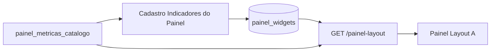

# Manual — Editar widget do Painel

Guia campo a campo do drawer **Editar widget do painel** / **Novo widget** em  
`/cadastros/indicadores-painel`.

Público: Administrador e Planejamento. O formulário grava em `painel_widgets`; o Painel Layout A lê via `GET /painel-layout` e renderiza em `LayoutA`.

---

## Contexto do formulário (fora dos campos)

Antes de editar um widget, a página já define:

| Controle na página | Função | Impacto no Painel |
|--------------------|--------|-------------------|
| **Perfil** (APS / MAC / Hospitalar) | Filtra a lista e é gravado no widget | Só widgets do perfil selecionado no Painel aparecem quando o usuário escolhe esse perfil no seletor do Painel |
| **Layout** | Fixo em `A` neste cadastro | Layouts B/C não usam estes widgets dinâmicos |
| **Lista na página** | Mostra **ativos e inativos** do perfil/layout | Inativos ficam visíveis no cadastro com chip **Inativo**; no Painel só entram os **ativos** |
| **Ordem** | Coluna **Ordem** com botões **↑** / **↓** na tabela (ou ordem inicial na criação) | Define a sequência no Painel: **cards** na grade (até 6 APS / 9 MAC-Hospitalar), **1º** `grafico_linha` na tendência, **1º** `grafico_ranking`/`grafico_barra` no ranking inferior. Widgets extras do mesmo tipo não aparecem no Painel |
| **Reativar** | Botão na linha inativa | Volta `status=ativo`; o widget passa a aparecer no Painel na próxima carga do layout |

Inativar um widget (ação da tabela, não deste drawer) remove-o do layout resolvido até ser reativado.

---

## 1. Identificação e apresentação

### Slug

| | |
|--|--|
| **Obrigatório** | Sim |
| **O que é** | Identificador estável do widget (ex.: `atendimentos`, `sia_taxa_glosa`, `total_aih`) |
| **Função** | Chave lógica única junto com `(perfil, layout)`. Usado em API, testes e como `id` interno do KPI no frontend |
| **Impacto no Painel** | Não aparece na tela. Trocar o slug de um widget já em uso quebra referências estáveis (E2E, bookmarks internos). Prefira manter o slug e alterar só o título |
| **Boas práticas** | `snake_case`, sem acento, curto e único no perfil |

### Título

| | |
|--|--|
| **Obrigatório** | Sim |
| **O que é** | Nome exibido do indicador |
| **Função** | Texto principal do card / título do gráfico de tendência ou ranking |
| **Impacto no Painel** | Aparece no `KpiCard` (label) e nos cabeçalhos das seções de linha e ranking. É o que o gestor lê primeiro |

### Subtítulo

| | |
|--|--|
| **Obrigatório** | Não |
| **O que é** | Texto auxiliar sob o título (ex.: `Comp. Qualidade`, `Produção SIA · mês`, `dias/AIH`) |
| **Função** | Contextualiza unidade, recorte ou fonte sem alongar o título |
| **Impacto no Painel** | Exibido no card quando preenchido. Em gráficos, entra no payload resolvido; o Layout A usa sobretudo o título nas seções de tendência/ranking |
| **Vazio** | Gravado como `null` — sem linha auxiliar |

---

## 2. Tipo e formato (como o valor é mostrado)

### Tipo

Define **qual componente** o Painel usa para este widget.

| Valor | UI no Painel | Contrato da métrica / SQL |
|-------|--------------|---------------------------|
| **Card** | Card KPI na grade superior (até 6 em APS, até 9 em MAC/Hospitalar) | Valor escalar (`valor`) + opcional sparkline |
| **Linha** (`grafico_linha`) | Gráfico de tendência (área esquerda inferior) | Série temporal: linhas com `competencia` + `valor` |
| **Ranking** (`grafico_ranking`) | Lista com barras (área direita inferior) | Linhas com rótulo (`unidade` / `label`) + `valor` |
| **Barra** (`grafico_barra`) | Tratado como ranking no resolvedor atual | Mesmo formato de ranking |

**Impacto prático**

- Só entra na **grade de cards** quem for `tipo = card`.
- O Layout A usa **apenas o primeiro** widget `grafico_linha` (por `ordem`) e **apenas o primeiro** ranking/barra.
- Vários cards podem coexistir; vários gráficos do mesmo tipo — só o primeiro de cada família aparece nas duas áreas inferiores.

### Formato

Define **como formatar o número** (e, em um caso, a lógica especial de fração).

| Valor | Exibição típica | Observação importante |
|-------|-----------------|------------------------|
| **Número** | `1.234` (pt-BR) | Padrão para contagens |
| **Percentual** | multiplica por 100 e acrescenta `%` (1 casa) | O SQL deve devolver **fração 0–1** (ex.: `0,855` → `85,5%`). Se o SQL já devolver `85,5`, a tela mostrará `8550,0%` |
| **Moeda** | `R$ 1.234,56` | Valor monetário em BRL |
| **Texto** | `String(value)` sem formatação numérica | Pouco usado em KPIs |
| **Fração** | `numerador / denominador` | Numerador = métrica principal; denominador = métrica apontada em `fonte_config.par_chave` (config avançada, não há campo dedicado neste drawer). Sem `par_chave`, mostra `N / 0` |

**Impacto no Painel:** só muda a máscara do valor (`valueLabel`), não a consulta — exceto **Fração**, que dispara segunda métrica.

---

## 3. Métricas vinculadas

### Buscar no catálogo

| | |
|--|--|
| **Obrigatório** | Não (ajuda a filtrar) |
| **O que é** | Campo de busca com debounce (~300 ms) sobre `painel_metricas_catalogo` |
| **Função** | Filtra as opções dos selects de métrica por nome ou chave (`sia.taxa_glosa`, `sih.total_aih`, …) |
| **Impacto no Painel** | Nenhum direto — só facilita a escolha no cadastro |
| **Catálogo** | Atualizado pelo botão **Atualizar catálogo** na página (descoberta a partir do e-SUS raw) |

### Métrica principal

| | |
|--|--|
| **Obrigatório** | Sim |
| **O que é** | FK para `painel_metricas_catalogo` |
| **Função** | Define o `sql_template` padrão (ou o SQL customizado) que calcula o valor do widget |
| **Impacto no Painel** | É a fonte do número do card, da série da linha ou das barras do ranking. Sem métrica válida, o widget resolve vazio / `—` |
| **Placeholders no SQL** | `:competencia`, `:estabelecimento_id`, `:equipe_id` — preenchidos no servidor conforme filtros do Painel |

### Métrica sparkline (opcional)

| | |
|--|--|
| **Obrigatório** | Não (`Sem sparkline`) |
| **O que é** | Segunda métrica, tipicamente série histórica curta |
| **Função** | Alimenta o mini-gráfico (sparkline) dentro do **card** |
| **Impacto no Painel** | Só faz sentido com `tipo = card`. Em gráficos de linha/ranking, o valor principal já é a série; sparkline é secundário |
| **SQL esperado** | Lista de pontos (`valor` por competência ou ordem); o card usa o array `sparkSeries` |

---

## 4. SQL customizado

### SQL customizado — métrica principal

| | |
|--|--|
| **Obrigatório** | Não |
| **Controle** | Checkbox: desligado = usa `sql_template` do catálogo (somente leitura); ligado = edita `sql_override` do **widget** |
| **Função** | Sobrescreve o SQL só deste widget, sem alterar o catálogo compartilhado |
| **Impacto no Painel** | O runtime executa `sql_override` se preenchido; senão, o template da métrica. Outros widgets que usam a mesma métrica **não** mudam |
| **Restaurar catálogo** | Desliga o override e volta ao template da métrica |
| **Exemplos** | Painel lateral / “Inserir exemplo” — colam templates seguros com os placeholders oficiais |

### SQL customizado — sparkline

Igual ao bloco da principal, mas grava em `spark_sql_override` e só aparece se houver **Métrica sparkline** selecionada.

---

## 5. Testar execução (não grava no Painel)

Estes controles **não são salvos** no widget; servem só para validar o SQL antes de publicar.

| Campo | Função | Relação com o Painel |
|-------|--------|----------------------|
| **Competência** | Escopo temporal do teste (`YYYY-MM`) | No Painel real, vem do filtro global de competência |
| **Estabelecimento** | Unidade ou “Municipal (todas)” | Equivale ao filtro de unidade do Painel (`estabelecimento_id` / `NULL` municipal) |
| **Executar teste** | Chama `POST` preview com o **rascunho atual da tela** (métricas, formato, SQL customizado ainda não salvos). Não envia só o `widgetId` do banco | Mostra `valueLabel`, tamanho da sparkline/série — **não** altera o Painel até **Salvar widget** |

---

## 6. Referência SQL (aside)

Material de apoio: exemplos por família (contrato, e-SUS, SIA, SIH…). Botões **→ Principal** / **→ Sparkline** ativam o SQL customizado e colam o exemplo. Não persistem sozinhos — é preciso salvar o formulário.

---

## 7. Ações do rodapé

| Botão | Efeito |
|-------|--------|
| **Cancelar** | Fecha sem gravar |
| **Salvar widget** | Cria ou atualiza `painel_widgets` (perfil da página + layout `A`). No próximo carregamento do Painel com aquele perfil, o Layout A reflete título, tipo, formato, métricas e SQL |

---

## Mapa rápido: campo → impacto

| Campo do drawer | Persiste? | O que muda no Painel |
|-----------------|-----------|----------------------|
| Slug | Sim | Identidade interna (não visual) |
| Título | Sim | Texto do card / título do gráfico |
| Subtítulo | Sim | Linha auxiliar do card |
| Tipo | Sim | Card vs linha vs ranking (e qual região da tela) |
| Formato | Sim | Máscara do número (e lógica de fração) |
| Métrica principal | Sim | Número / série / ranking |
| Métrica sparkline | Sim | Mini-série no card |
| SQL principal / spark | Sim (se customizado) | Consulta efetiva daquele widget |
| **Competência** / **Estabelecimento** / **Executar teste** | Só preview no cadastro — usa o **rascunho da tela** (métricas + SQL customizado), sem precisar salvar primeiro |
| Perfil (página) | Sim, no registro | Em qual perfil o widget aparece |
| Ordem (↑/↓ na tabela) | Sim | Posição na grade / prioridade dos gráficos no Painel |
| Status ativo/inativo | Sim (Inativar / Reativar) | Só **ativos** entram no Painel |

---

## Campos avançados (não estão neste drawer)

Existem na tabela/API e podem ter sido definidos por seed/migration:

| Campo | Uso |
|-------|-----|
| `fonte_config` | Ex.: `fallback_chave`, `par_chave` (fração), eixos de ranking |
| `spark_config` | Opções extras da sparkline |
| `delta_config` | Variação vs competência anterior ou texto fixo no card |
| `sql_preview` | Espelho/documentação do SQL (legado); o override é a fonte real de customização |

Alterá-los hoje exige API/SQL ou evolução futura da UI.

---

## Checklist ao publicar um widget

1. Perfil correto (APS / MAC / Hospitalar) na página.
2. **Tipo** alinhado ao papel desejado (card vs gráfico).
3. **Formato** coerente com o que o SQL devolve (especialmente percentual 0–1).
4. Métrica (e sparkline, se card) com SQL que respeita `:competencia` / `:estabelecimento_id` / `:equipe_id`.
5. **Executar teste** com competência e unidade típicas.
6. **Salvar** e abrir o Painel no mesmo perfil + Layout A para validar.

---

## Referências técnicas

- UI: `WidgetEditDrawer.tsx`, `indicadoresPainelView.ts`
- Runtime: `painelWidgetsService.js` → `resolvePainelLayout` / `previewWidget`
- Painel: `LayoutA.tsx`, `painelWidgetsView.ts`, `usePainelLayout.ts`
- Spec: `docs/superpowers/specs/2026-06-20-painel-widgets-dinamicos-design.md`
- Workflow agent: [cadastros.md — painel-widgets-dinamicos](cadastros.md#workflow-painel-widgets-dinamicos)
