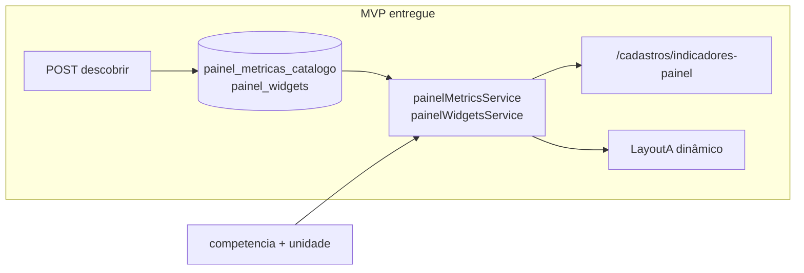

# Painel dinâmico — widgets e catálogo de métricas

**Data:** 2026-06-20 · **Atualizado:** 2026-06-21  
**Status:** MVP entregue (tasks 01–18) · backlog fases 2–3 abaixo  
**Compozy:** [`.compozy/tasks/painel-widgets-dinamicos/`](../../../.compozy/tasks/painel-widgets-dinamicos/) · PRD · TechSpec · ADRs 001–003

---

## 1 — Contexto e decisões

| Tópico | Decisão |
|--------|---------|
| Objetivo | Cadastro de widgets/métricas governadas para compor o Painel APS Layout A de forma dinâmica |
| Fonte de dados | SQL em tempo real via templates parametrizados no backend (ADR-001) |
| Runtime | Endpoint dedicado `GET /painel-layout` separado de `/planejamento` (ADR-002) |
| Binding SQL | Placeholders nomeados `:competencia`, `:estabelecimento_id`, `:equipe_id` → `$n` no servidor (ADR-003) |
| Cadastro | Lista flat `painel_metricas_catalogo`; `sql_preview` read-only na UI |
| Permissão | Leitura JWT; escrita Administrador + Planejamento (`requirePlanningStaff`) |
| Escopo MVP | Perfil `APS`, layout `A`, 6 cards + 2 gráficos (paridade seed Layout A) |
| Resiliência | `LayoutA` mantém fallback `buildPainelKpis` se layout API falhar ou vier vazio |

---

## 2 — Implementado (Phase 0 + MVP)

### 2.1 Schema e seed (migration 008)

Arquivo: [`migration_008_painel_widgets.sql`](../../../migration_008_painel_widgets.sql) · init Docker `08-…`

**`painel_metricas_catalogo`:** `chave`, `fonte_tipo`, `agregacao`, `sql_template`, metadados EAV e-SUS, `ocorrencias`.

**`painel_widgets`:** `perfil`, `layout`, `ordem`, `tipo`, `metrica_id`, `spark_metrica_id`, `fonte_config`, `delta_config`, `sql_preview`. UNIQUE `(perfil, layout, slug)`.

**Seed:** 10 métricas + 8 widgets APS Layout A (cards atendimentos, cobertura, equipes, metas, odonto, coletivas + linha + ranking). Placeholders cobertura/equipes retornam NULL.

### 2.2 Backend

| Módulo | Artefato | Status |
|--------|----------|--------|
| A Executor | `painelMetricsService.js` — `bindTemplate`, `executeMetric`, `discoverMetricsFromRaw` | ✅ |
| B CRUD cadastro | `painelWidgetsCadastrosRoutes.js`, `painelMetricasCadastrosRoutes.js` | ✅ |
| C Runtime | `GET /api/v1/dashboard/painel-layout` | ✅ |
| F Descoberta | `POST /api/cadastros/painel-metricas/descobrir` + audit | ✅ |

Auditoria: `painel_widget_*`, `painel_metricas_descobrir`.

### 2.3 Frontend

| Módulo | Artefato | Status |
|--------|----------|--------|
| D Cadastro UI | `IndicadoresPainelPage.tsx`, `WidgetPreviewModal.tsx`, `api/painelWidgets.ts` | ✅ |
| E Painel dinâmico | `usePainelLayout.ts`, `LayoutA.tsx` + `painelWidgetsView.ts`, fallback hardcoded | ✅ |
| Grid/rota | `cadastroEntities.ts` card `indicadores-painel`, `/cadastros/indicadores-painel` | ✅ |

Funcionalidades cadastro: CRUD widgets, picker métricas (debounce), preview competência/unidade, painel SQL colapsável, **Atualizar catálogo**.

### 2.4 Testes e docs

| Item | Status |
|------|--------|
| Jest `painelMetricsService`, `painelWidgetsService`, rotas cadastro | ✅ |
| Vitest LayoutA, IndicadoresPainelPage, painelWidgetsView | ✅ |
| E2E `painel-widgets.spec.ts` (edit título → Painel Layout A) | ✅ |
| Agent docs (`docs/agent/*`, `CLAUDE.md`) | ✅ task 18 |

### 2.5 O que permanece estático / híbrido

| Componente | Estado pós-MVP |
|------------|----------------|
| `LayoutB.tsx`, `LayoutC.tsx` | Ainda `buildPainelKpis` hardcoded |
| `GET /planejamento` | Inalterado — `ModuleStatusBar`, fallback KPI path |
| Perfis MAC/Hospitalar/Misto | Placeholder; widgets só seed APS/A |
| Tabela `indicadores` (migration 003) | Separada de `painel_metricas_catalogo` |
| Card `/admin` “Indicadores e Metas” | Coexiste com `/cadastros/indicadores-painel` |

---

## 3 — Backlog (não implementado)

| Módulo | Escopo | Depende de |
|--------|--------|------------|
| **G** Layouts B/C e outros perfis | Widgets para Layout B/C; perfis MAC/Hospitalar | MVP estável |
| **H** Integração `indicadores` (003) | FK ou view unificada com catálogo painel | decisão produto |
| **Phase 2** SQL preview editável | Override de template por widget | governança |
| **Phase 3** Batch `resolveAllWidgets` | Reduzir N+1 queries no layout | observabilidade |
| **Phase 3** Grid variável | Slot count ≠ 8 | CSS grid |
| **Auto discovery pós-import** | Hook em `importacao.js` além do botão manual | F entregue |

Checklist rápido módulos A–J: **A–F, I, J ✅** · **G, H pendente**.

---

## 4 — Matriz de dependências (referência)

Ordem executada no MVP: **A → B → C → D/E (paralelo frontend) → F → I → J**.

| Módulo | Depende de | Solo? |
|--------|------------|-------|
| A Executor | — | Sim |
| B CRUD | A (preview) | Parcial |
| C Runtime | A | Não |
| D Cadastro UI | B | Não |
| E Painel UI | C | Não |
| F Descoberta | B | Após B mínimo |
| G B/C/outros | E | Não |
| H indicadores 003 | B/D | Paralelo |
| I E2E | D+E | Não |
| J Docs | entregas | Incremental |

---

## 5 — Riscos e decisões em aberto

1. **Híbrido vs substituição:** Painel continua `/planejamento` para status de módulos; KPIs dinâmicos vêm de `/painel-layout`.
2. **Filtro unidade + ranking:** com unidade selecionada, ranking retorna no máximo uma barra ou vazio (TechSpec default).
3. **Performance:** 8 widgets × 1–3 SQL cada — batch deferred Phase 3; log `painel.layout.resolve`.
4. **SQL editável:** MVP só read-only; templates só via seed/discovery UPSERT.
5. **Odonto spark:** seed usa histórico de atendimentos — documentado; métrica dedicada Phase 2.

---

## Referências agente

| Doc | Conteúdo |
|-----|----------|
| [backend-api.md](../../agent/backend-api.md) | Endpoints painel-layout, painel-widgets, painel-metricas |
| [cadastros.md](../../agent/cadastros.md#workflow-painel-widgets-dinamicos) | Fluxo cadastro + discovery |
| [frontend.md](../../agent/frontend.md#painel) | LayoutA dinâmico, `usePainelLayout` |
| [database.md](../../agent/database.md) | Tabelas migration 008 |
| [testing-ci.md](../../agent/testing-ci.md) | E2E `painel-widgets.spec.ts` |
